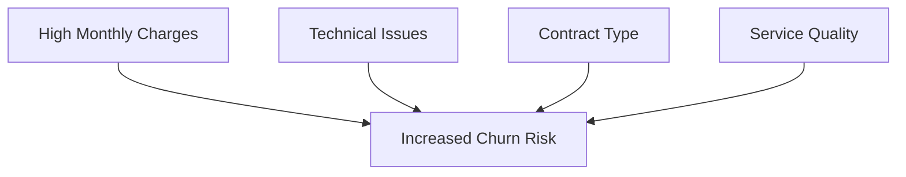

# 📱 Telecom Customer Churn Analysis

> An in-depth analysis of customer retention patterns in the telecommunications industry using advanced analytics and Power BI visualization.


## 🎯 Project Objective

This project delivers comprehensive insights into telecom customer churn patterns, enabling data-driven decisions to enhance customer retention. Through detailed analysis of customer behavior, service usage, and satisfaction metrics, we provide actionable recommendations to minimize churn and maximize customer lifetime value.

## 📊 Tasks Performed

### 🔍 Data Engineering
- Comprehensive data collection and cleaning
- Feature engineering for enhanced analysis
- Dataset preprocessing and validation

### 📈 Analytics & Visualization
- KPI development and tracking
- Interactive Power BI dashboard creation
- Trend analysis and pattern recognition

### 💡 Strategic Insights
- Churn driver identification
- Customer behavior analysis
- Revenue impact assessment

## 📌 Key Performance Indicators

| KPI Category | Metrics Tracked |
|--------------|----------------|
| Customer Retention | • Churn Rate<br>• Disconnected Customers<br>• Active Customer Base |
| Financial Metrics | • Average Annual Charges<br>• Average Monthly Charges |
| Customer Engagement | • Average Months (With/Without Churn)<br>• Technical Support Tickets |

## 🎨 Visual Analytics Components

### 📊 Revenue Analysis
1. **Demographic Insights**
   - Revenue distribution by gender
   - Service-based revenue patterns

2. **Churn Analysis by Factors**
   ```
   ├── Service Type
   ├── Payment Method
   ├── Contract Duration
   └── Customer Tenure
   ```

### 🔥 High-Risk Segments
- Premium customers (>$100 monthly charges)
- Service quality impact analysis
- Contract type correlation

## 📊 Key Visualizations

### 💰 Revenue Metrics

- Gender-based revenue contribution
- Service type revenue analysis
- Payment method distribution

### 📉 Churn Indicators

- Internet service impact
- Payment preferences
- Contract type influence
- Tenure correlation

### 🔧 Service Quality Metrics

- Technical ticket analysis
- Service type correlation
- Contract impact assessment

## 💡 Interactive Features

- **Dynamic Filtering**: Segment-specific analysis
- **Drill-Down Capabilities**: Detailed customer insights
- **Custom Views**: Personalized dashboard layouts

## 📈 Sample Insights



## 🎓 Conclusions & Recommendations

### 📌 Key Findings
1. **Customer Behavior Patterns**
   - Payment preference impact
   - Service usage correlation
   - Tenure significance

2. **Risk Factors**
   - High-charge customer sensitivity
   - Technical support importance
   - Contract type influence

### 🎯 Strategic Recommendations
- Targeted retention programs
- Service quality improvements
- Contract optimization strategies

## 🛠️ Tools & Technologies

| Category | Tools Used |
|----------|------------|
| Analysis | Power BI, Python |
| Data Processing | Pandas, NumPy |
| Visualization | Power BI Desktop |
| Reporting | Custom Dashboards |

## 📫 Contact

For questions or feedback about this analysis, please contact:
- 📧 Email: [susantabaidya20133@gmail.com]
- 💼 LinkedIn: [https://www.linkedin.com/in/susanta-baidya-03436628a/e]

---

*Made with 📊 by [Your Name/Team]*
